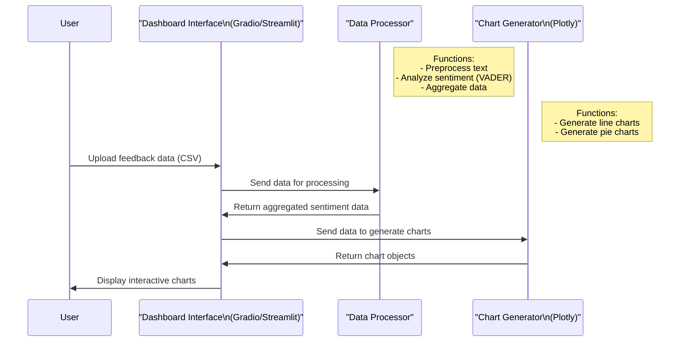

# Pulse
Employee Sentiment Visualization Dashboard


# Pulse: Employee Sentiment Visualization Dashboard

  
  
  


**Pulse** is an interactive dashboard that analyzes and visualizes employee feedback to provide insights into workplace sentiment. Using Natural Language Processing (NLP) and data visualization, Pulse helps HR teams and managers understand employee morale, track trends over time, and identify areas for improvement.

---

## Table of Contents
- [Overview](#overview)
- [Features](#features)
- [Tech Stack](#tech-stack)
- [Setup Instructions](#setup-instructions)
- [Usage](#usage)
- [Project Structure](#project-structure)
- [Step-by-Step Explanation](#step-by-step-explanation)
- [Future Enhancements](#future-enhancements)
- [Contributing](#contributing)
- [License](#license)

---

## Overview
Pulse transforms raw employee feedback into actionable insights. By leveraging sentiment analysis and interactive visualizations, it enables HR professionals to:
- Monitor sentiment trends over time.
- Identify patterns in positive, negative, and neutral feedback.
- Make data-driven decisions to improve employee engagement.

This project is built with Python, using libraries like `NLTK` for sentiment analysis and `Plotly` for dynamic charts, all wrapped in a user-friendly `Streamlit` dashboard.

---

## Features
- **Sentiment Analysis**: Classifies feedback as positive, negative, or neutral using VADER.
- **Interactive Visualizations**: Includes line charts, bar charts, and pie charts to explore sentiment data.
- **Data Aggregation**: Summarizes sentiment by time periods (e.g., monthly) for trend analysis.
- **User-Friendly Interface**: Built with `Streamlit` for easy navigation and interactivity.

---

## Tech Stack
- **Python 3.7+**
- **Libraries**:
  - `pandas`: Data manipulation
  - `nltk`: Text preprocessing and sentiment analysis
  - `plotly`: Interactive visualizations
  - `streamlit`: Web app framework
- **Tools**:
  - VADER (Valence Aware Dictionary and Sentiment Reasoner) for sentiment analysis



---

## Setup Instructions
Follow these steps to set up the project on your local machine:

### 1. Clone the Repository
```bash
git clone https://github.com/your-username/pulse-dashboard.git
cd pulse-dashboard

```


## 2. Install Dependencies
Ensure you have Python installed, then run:

```bash
pip install -r requirements.txt
```

## 3. Download NLTK Resources
Open a Python shell and run:

```python
import nltk
nltk.download('vader_lexicon')
nltk.download('punkt')
nltk.download('stopwords')
```

## 4. Prepare Sample Data
A sample feedback file (`sample_feedback.csv`) is provided in the `data/` folder.
You can also generate your own data using the provided script.

## 5. Run the Dashboard

```bash
streamlit run src/dashboard.py
```

The dashboard will open in your browser at [http://localhost:8501](http://localhost:8501).

## Usage
Once the dashboard is running:

- **View Trends**: Explore the line chart to see average sentiment over time.
- **Analyze Counts**: Use the bar chart to see the distribution of positive, negative, and neutral feedback.
- **Overall Sentiment**: The pie chart shows the overall sentiment distribution.
- **Upload New Data (Optional)**: Upload your own `aggregated_sentiment.csv` to analyze custom datasets.

## Project Structure

```
pulse-dashboard/
├── data/
│   ├── sample_feedback.csv           # Sample employee feedback data
│   ├── preprocessed_feedback.csv     # Preprocessed feedback data
│   ├── feedback_with_sentiment.csv   # Feedback with sentiment scores
│   └── aggregated_sentiment.csv      # Aggregated sentiment data for visualization
├── src/
│   ├── preprocess.py                 # Text preprocessing script
│   ├── sentiment_analysis.py         # Sentiment analysis script
│   ├── aggregate_data.py             # Data aggregation script
│   ├── visualizations.py             # Visualization generation script
│   └── dashboard.py                  # Streamlit dashboard script
├── requirements.txt                  # Python dependencies
└── README.md                         # Project documentation
```

## Step-by-Step Explanation
This project is built in a series of modular steps, each handling a specific part of the data pipeline:

### 1. Prepare or Simulate Feedback Data
- **Description**: Create or gather employee feedback data.
- **Script**: `src/preprocess.py`
- **Output**: `data/sample_feedback.csv`
- **Details**: Collects raw feedback (e.g., text comments with timestamps) for analysis.

### 2. Implement Text Preprocessing
- **Description**: Clean the feedback text (lowercase, remove punctuation, stop words).
- **Script**: `src/preprocess.py`
- **Output**: `data/preprocessed_feedback.csv`
- **Details**: Standardizes text by removing noise like punctuation and common words.

### 3. Perform Sentiment Analysis
- **Description**: Use VADER to analyze sentiment and assign scores.
- **Script**: `src/sentiment_analysis.py`
- **Output**: `data/feedback_with_sentiment.csv`
- **Details**: VADER assigns sentiment scores (positive, negative, neutral) to feedback.

### 4. Aggregate Sentiment Data
- **Description**: Summarize sentiment scores by time periods (e.g., monthly).
- **Script**: `src/aggregate_data.py`
- **Output**: `data/aggregated_sentiment.csv`
- **Details**: Groups sentiment data by time, making it easier to spot trends.

### 5. Generate Visualizations
- **Description**: Create interactive charts using Plotly.
- **Script**: `src/visualizations.py`
- **Output**: Embedded in the dashboard.
- **Details**: Visualizations include line charts (trends), bar charts (counts), and pie charts (distribution).

### 6. Build the Dashboard Interface
- **Description**: Use Streamlit to display the visualizations interactively.
- **Script**: `src/dashboard.py`
- **Output**: A live web app at [http://localhost:8501](http://localhost:8501)
- **Details**: Streamlit provides a user-friendly web interface for exploring sentiment insights.

Each step is modular, allowing for easy updates or replacements (e.g., swapping VADER for a different NLP model).

## Future Enhancements
- **Real-Time Data**: Integrate with a database or API for live feedback updates.
- **Advanced NLP**: Use transformer models like BERT for more nuanced sentiment analysis.
- **Filters and Customization**: Add date range filters or department-based analysis.
- **Deployment**: Host the dashboard on a cloud platform for broader access.


Built with ❤️ by Amarnatha Gowda
