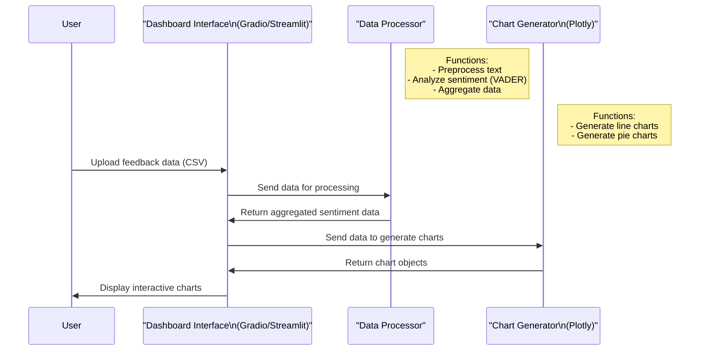

# Pulse
Employee Sentiment Visualization Dashboard

```mermaid
sequenceDiagram
    participant User
    participant Dashboard as "Dashboard Interface\n(Gradio/Streamlit)"
    participant Processor as "Data Processor"
    participant Charts as "Chart Generator\n(Plotly)"

    Note right of Processor: Functions:<br>- Preprocess text<br>- Analyze sentiment (VADER)<br>- Aggregate data
    Note right of Charts: Functions:<br>- Generate line charts<br>- Generate pie charts

    User->>Dashboard: Upload feedback data (CSV)
    Dashboard->>Processor: Send data for processing
    Processor->>Dashboard: Return aggregated sentiment data
    Dashboard->>Charts: Send data to generate charts
    Charts->>Dashboard: Return chart objects
    Dashboard->>User: Display interactive charts

```
